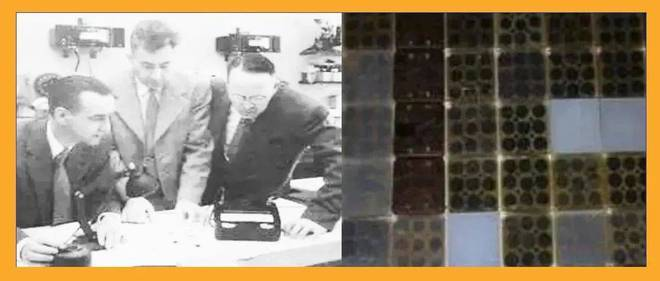
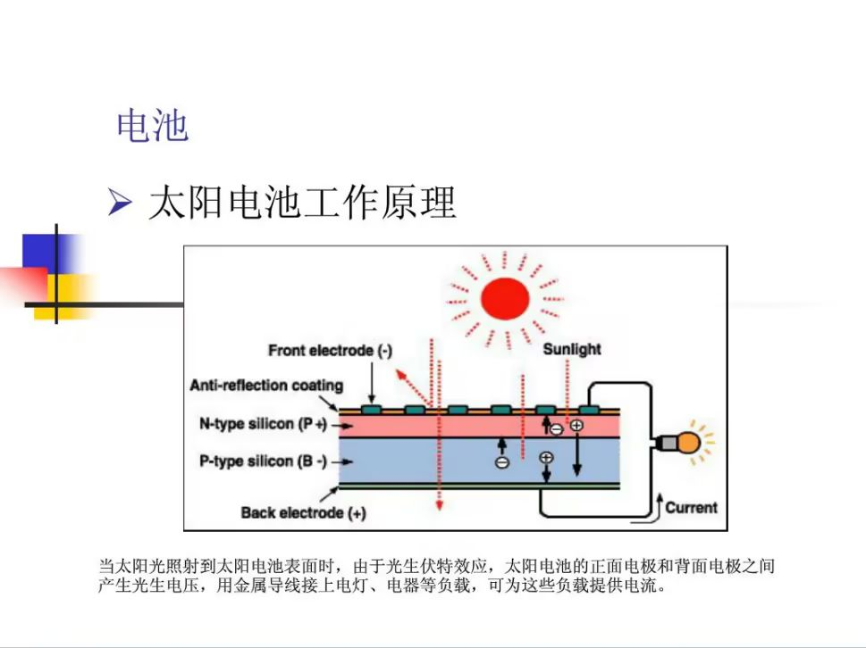
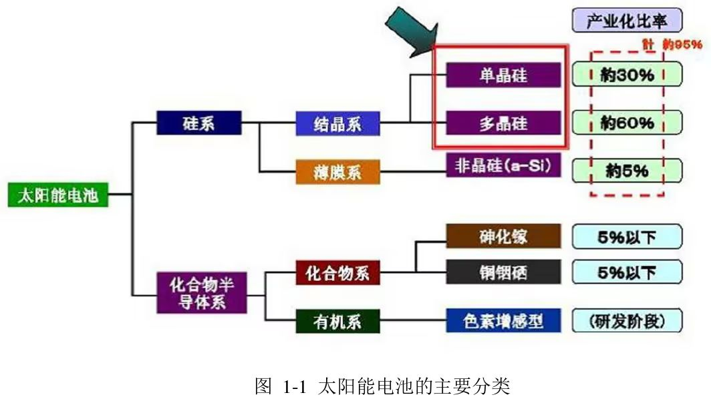

# 1.1 光伏效应与太阳能电池工作原理

## 1.1.1 光伏效应的发现与定义

光生伏特效应（简称光伏效应）是太阳能电池能够将光能直接转换为电能的基本物理原理。这一现象最早由法国物理学家A.E.贝克勒尔于1839年发现，他观察到在导电液中的两种金属电极在光照射时电流会加强。1883年，第一块硒太阳能电池由Charles Fritts制备成功，其效率仅为1%。术语"光生伏特"来源于希腊词根"photo"（光）和"voltaic"（伏特，以意大利物理学家亚历山德罗·伏特命名），意指由光产生电动势的现象。

**光伏效应**可定义为：**光照使不均匀半导体或半导体与金属结合的不同部位之间产生电位差的现象**。这一过程包含两个关键阶段：首先是光子能量转化为电子能量；其次是形成电压的过程，当电路连通时即可形成电流。

（*图片建议：展示光伏效应发现的历史图片或示意图，包括贝克勒尔实验示意图、早期太阳能电池图片*）

## 1.1.2 半导体基础与P-N结形成

太阳能电池的核心是半导体材料，其导电性介于导体和绝缘体之间。最常用的半导体材料是硅（Si），其为四价元素。半导体材料的光电转换特性源于其独特的能带结构：价带（充满电子）、导带（空置或部分填充）以及两者之间的禁带。

**P-N结的形成是太阳能电池工作的基础**。当在纯硅中掺入有五个电子的磷原子时，形成带负电的N型半导体；若掺入有三个电子的硼原子，则形成带正电的P型半导体。当P型和N型半导体结合在一起时，在交界面区域会形成一个特殊的薄层——**P-N结**。

在P-N结界面，由于载流子浓度差异，N区的电子会扩散到P区，P区的空穴会扩散到N区，形成由N指向P的"内建电场"，该电场阻止扩散进一步进行。平衡时，P-N结处形成稳定的电势差，这是太阳能电池能够产生电压的物理基础。

（*图片建议：展示半导体能带结构图、P型/N型半导体示意图、P-N结形成过程动画图解*）

## 1.1.3 光伏发电的物理过程

太阳能电池的发电过程可概括为以下四个基本步骤：

1. **光子吸收**：当太阳光照射到太阳能电池表面时，具有足够能量的光子穿过抗反射层进入半导体内部。
2. **电子-空穴对产生**：能量大于半导体禁带宽度的光子将价带中的电子激发到导带，形成电子-空穴对。
3. **电荷分离**：在P-N结内建电场的作用下，电子和空穴被分离——电子被驱向N区，空穴被驱向P区。
4. **电流输出**：在P区和N区两侧加上电极并连接负载，形成回路后即有光生电流通过，从而获得电能输出。

**关键参数**：对晶体硅太阳能电池而言，**开路电压**的典型值为0.5～0.6V。通过光照在界面层产生的电子-空穴对越多，电流越大；界面层吸收的光能越多，电池面积越大，形成的电流也越大。

（*图片建议：展示光子吸收与电子-空穴对产生示意图、电荷分离过程动画、太阳能电池工作原理完整流程图*）

## 1.1.4 太阳能电池的基本结构与分类

**太阳能电池的基本结构**是一个大面积平面P-N结。现代晶体硅太阳能电池通常通过扩散工艺，在P型硅片上形成N型区，在交界处形成P-N结（即N+/P结构）。实际太阳能电池组件还包括**减反射膜**、**上下电极**和**封装材料**等部分。

**太阳能电池的分类**方式多样，按材料可分为：

- **硅太阳能电池**：单晶硅、多晶硅、非晶硅电池等
- **化合物半导体太阳能电池**：砷化镓（GaAs）、磷化铟（InP）、硫化镉（CdS）等
- **薄膜太阳能电池**：非晶硅薄膜、多晶硅薄膜、碲化镉（CdTe）等
- **新型太阳能电池**：有机太阳能电池、染料敏化太阳能电池、钙钛矿电池等

*表：主要太阳能电池类型性能比较*

| 电池类型 | 转换效率    | 优点                          | 缺点                   |
| -------- | ----------- | ----------------------------- | ---------------------- |
| 单晶硅   | 15%-24%     | 转换效率高，寿命长（15-25年） | 制造成本高             |
| 多晶硅   | 约12%-14.8% | 成本较低，制造工艺简单        | 效率较低，寿命较短     |
| 非晶硅   | 约10%       | 弱光发电性好，成本低          | 效率低，稳定性差       |
| 砷化镓   | 18%-29%     | 效率高，耐辐照                | 成本高昂，主要用于航天 |

（*图片建议：展示不同类型太阳能电池的实物图与结构对比图、太阳能电池分类树状图*）

## 1.1.5 光伏发电系统的基本构成

一个完整的光伏发电系统通常由以下部分组成：

1. **太阳能电池方阵**：由多个太阳能电池组件串联、并联组成，是系统的发电部分。
2. **蓄电池组**：储存太阳能电池方阵发出的电能，供需要时使用。
3. **控制器**：自动防止蓄电池过充电和过放电，提高系统寿命。
4. **逆变器**：将直流电转换成交流电，供交流负载使用。

光伏发电系统可分为**独立光伏发电系统**（离网）、**并网光伏发电系统**和**分布式光伏发电系统**三种主要类型。

（*图片建议：展示光伏发电系统组成框图、不同应用场景（独立、并网、分布式）的系统示意图*）

## 1.1.6 总结

光伏效应是太阳能电池工作的基础物理原理，通过半导体P-N结的光生伏特效应，太阳能被直接转换为电能。理解这一原理对于后续学习光伏电池的I-V特性、最大功率点跟踪等关键技术至关重要。随着材料技术和制造工艺的进步，太阳能电池的转换效率不断提高，成本持续下降，使得光伏发电在全球能源结构中的比重不断增加。

（*图片建议：展示太阳能电池发展历程时间轴、未来技术展望图*）

---
**本节重点概念**：

- 光伏效应是光能直接转换为电能的物理现象
- P-N结的内建电场是电荷分离的关键
- 光子能量必须大于半导体禁带宽度才能产生电子-空穴对
- 太阳能电池的性能由开路电压、短路电流、填充因子和转换效率等参数表征
- 光伏发电系统可根据需求配置为独立、并网或分布式系统
