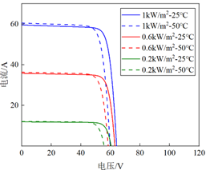
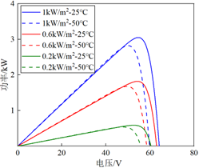
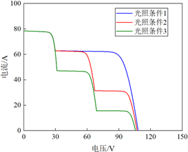
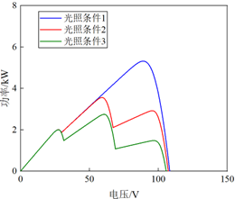

# 1.2 光伏阵列的I-V与P-V特性曲线分析

## 1.2.1 I-V与P-V特性的物理基础与数学描述

光伏阵列的电流-电压（I-V）和功率-电压（P-V）特性曲线是分析其发电性能的核心工具。I-V曲线描述了光伏阵列在不同工作电压下输出电流的变化规律，而P-V曲线则通过功率计算（P = V × I）直接展示了输出功率随电压的变化关系。

**光伏电池的等效电路模型**是理解这些特性的基础。通常采用单二极管模型，包含光生电流源、二极管、串联电阻（Rs）和并联电阻（Rsh）等组件。其数学表达式为：

$
    I = I_{ph} - I_0 \left[ \exp \left( \frac{V + IR_s}{nV_{th}} \right) - 1 \right] - \frac{V + IR_s}{R_{sh}}
$

其中关键参数包括光生电流（Iph）、二极管反向饱和电流（I0）、理想因子（n）和热电压（Vth）。

*表1：光伏阵列I-V特性关键参数及其物理意义*

| **参数符号** | **参数名称** | **物理意义**           | **影响因素**       |
| ------------ | ------------ | ---------------------- | ------------------ |
|$I_{ph}$| 光生电流     | 光照下半导体产生的电流 | 辐照度、电池面积   |
|$I_0$  | 反向饱和电流 | PN结扩散电流大小       | 材料特性、温度     |
|$R_s$  | 串联电阻     | 内部导体和接触电阻     | 材料纯度、工艺质量 |
|$R_{sh}$| 并联电阻     | 漏电流损耗             | 材料缺陷、清洁度   |
|$n$    | 理想因子     | PN结完美程度           | 半导体特性         |

在实际工程应用中，常采用简化模型，忽略并联电阻的影响，并通过开路电压（Voc）、短路电流（Isc）和最大功率点参数来构建实用表达式。

## 1.2.2 标准测试条件下的特性曲线分析

在标准测试条件（STC：辐照度1000W/m²，电池温度25°C，AM1.5）下，光伏阵列的I-V和P-V曲线呈现出典型的特征形态。

**I-V曲线特征点**：

- **短路电流（Isc）**：电压为零时的最大输出电流，与辐照度近似成正比
- **开路电压（Voc）**：电流为零时的最大输出电压，随温度升高而降低
- **最大功率点（MPP）**：对应输出功率最大的工作点，电压和电流分别记为Vmpp和Impp

**P-V曲线特征**：

- 单峰特性，在均匀光照下存在唯一的最大功率点
- MPP左侧功率随电压近似线性增加，右侧则快速下降
- 填充因子（FF = Pmax/(Voc × Isc)）是衡量曲线“方形度”的重要指标

[图1：标准测试条件下的典型I-V和P-V曲线示意图]
（此处留图位：展示STC下的I-V和P-V曲线，标注Isc、Voc、MPP等关键点）

## 1.2.3 环境因素对特性曲线的影响

### 辐照度影响分析

当温度不变，辐照度变化时：

- I-V曲线的“电流平台”区域随辐照度增强而上移，短路电流与辐照度近似正比
- 开路电压变化不大，随辐照度增加略有提高
- P-V曲线的峰值功率随辐照度增加而显著提高，最大功率点电压基本稳定在开路电压的78%左右

[图2：不同辐照度下的I-V和P-V曲线变化示意图]
（此处留图位：展示不同辐照度（如200-1000W/m²）下的曲线族）

### 温度影响分析

当辐照度不变，温度变化时：

- I-V曲线的开路电压随温度升高显著下降（约0.3-0.4%/°C）
- 短路电流随温度升高略有增加
- P-V曲线的峰值功率随温度升高而降低，最大功率点电压也随之下降

*表2：环境因素对光伏特性参数的影响趋势*

| **参数**       | **辐照度增加** | **温度升高** | **工程意义**     |
| -------------- | -------------- | ------------ | ---------------- |
| 短路电流(Isc)  | 显著增加       | 略微增加     | 决定电流容量设计 |
| 开路电压(Voc)  | 略微增加       | 显著降低     | 决定电压等级设计 |
| 最大功率(Pmax) | 显著增加       | 降低         | 系统功率评估基础 |
| MPP电压(Vmpp)  | 基本稳定       | 降低         | MPPT算法重要参数 |

## 1.2.4 局部遮阴条件下的特性曲线畸变与多峰现象

局部遮阴是实际工程中导致特性曲线畸变的主要原因，其机理可通过旁路二极管的工作原理解释。

**旁路二极管的作用机制**：
现代光伏组件通常在每个电池串两端并联旁路二极管。当部分电池被遮挡时，其产生的电流降低，成为串联电路中的“瓶颈”。一旦被遮挡电池两端的反向偏压超过旁路二极管的开启电压（通常为0.6-0.7V），二极管导通，电流绕过被遮挡电池，形成新的电流路径。

**多峰曲线的形成机理**：
在局部遮阴条件下，I-V曲线呈现**阶梯状**特征，每个“阶梯”对应不同数量的旁路二极管导通状态。相应地，P-V曲线则出现**多个峰值**，包括一个全局最大功率点（GMPP）和若干局部最大功率点（LMPP）。

- **GMPP（全局最大功率点）**：对应系统可能输出的最大功率
- **LMPP（局部最大功率点）**：对应局部最优工作点，功率值低于GMPP

[图3：局部遮阴条件下的多峰P-V曲线示意图]
（此处留图位：展示典型的双峰或多峰P-V曲线，标注GMPP和LMPP位置）

**曲线畸变的工程影响**：

1. **MPPT挑战**：传统算法（如P&O、IncCond）易陷入LMPP，导致功率损失
2. **热斑效应**：被遮挡电池可能消耗功率发热，造成永久损伤
3. **系统效率下降**：多峰特性使系统平均效率降低10-30%，严重时可达50%

## 1.2.5 特性曲线的测试与异常分析

现场I-V曲线测试是评估光伏阵列健康状况的重要手段。正常曲线平滑且符合预期形状，而异常曲线则反映出各种潜在问题。

**常见异常曲线类型及诊断**：

*表3：光伏阵列I-V曲线异常类型与故障诊断*

| **异常现象**     | **曲线特征**        | **可能原因**                 | **解决方案**           |
| ---------------- | ------------------- | ---------------------------- | ---------------------- |
| “多膝盖”现象     | I-V曲线出现多个台阶 | 旁路二极管短路、局部遮阴     | 检查遮挡物、更换二极管 |
| 短路电流偏小     | Isc明显低于标称值   | 组件功率衰减、辐照度测量误差 | 清洁组件、校准传感器   |
| 开路电压过低     | Voc明显低于标称值   | PID效应、完全遮挡            | 检查接地、消除遮挡     |
| “墙”倾斜角度变小 | I-V曲线右侧斜率减小 | 连接电阻过大、接头松动       | 检查接线盒、紧固接头   |
| 填充因子偏低     | 曲线“方形度”差      | 组件老化、内部缺陷           | 考虑组件更换           |

[图4：典型异常I-V曲线对比图]
（此处留图位：并列展示正常与几种典型异常曲线的对比）

**测试注意事项**：

- 测试前确保组件表面清洁，避免临时性遮挡影响
- 同一阵列需测试三次以上，排除环境波动影响
- 使用专业I-V曲线测试仪（如I-V400），确保数据准确性
- 记录测试时的辐照度、温度等环境参数，便于结果校正

## 1.2.6 特性曲线在系统设计与MPPT中的应用

光伏阵列的I-V和P-V特性曲线是系统优化设计和控制策略制定的基础。

**系统电压设计**：
根据Voc的温度系数合理确定串联组件数量，避免低温条件下电压超过逆变器最大输入电压。

**MPPT算法设计**：

- **传统算法**（P&O、IncCond）：适用于单峰曲线，通过工作点扰动寻找功率极值
- **全局MPPT算法**（PSO、扫描法）：针对多峰曲线，通过全局搜索定位GMPP
- **智能算法**（模糊逻辑、神经网络）：适应复杂环境变化，提高跟踪速度和精度

**阵列结构优化**：
基于特性曲线分析，可采用串并联优化、分布式MPPT（如微逆变器）等方案，减轻局部遮阴影响。

## 小结

光伏阵列的I-V和P-V特性曲线是理解其发电性能的核心工具，不仅反映了基本原理特性，也为指导系统设计、故障诊断和优化控制提供了关键依据。深入理解环境因素和局部遮阴对曲线形态的影响，对于提高光伏系统效率和可靠性具有重要意义。随着光伏技术的发展，特性曲线的精确建模和智能分析将继续在系统优化中发挥关键作用。

---
*注：本章节中的图表位置已标出，请根据实际教材排版需求插入相应的示意图和曲线图。*
